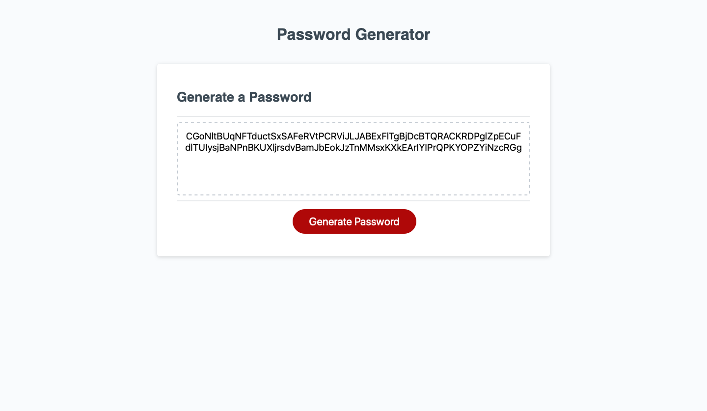

# Javascript: Password Generator

## Description 
A web-application that allows the user to select specific criteria and then generates a password matching those criteria.

## Table of Contents (Optional)

* [Usage](#usage)
* [Credits](#credits)
* [License](#license)
* [Tests](#tests)

## Usage 

Access web-page here: (https://omair-muhi.github.io/password-generator/)

## Credits
* UoT FSF Bcamp - this template

## License

MIT License

## Tests
#### Main
1. Test with 8 characters with all characters included.
2. Test with 128 characters with all characters included.
3. Test with 64 characters with lower-case and upper-case characters only.
4. Test with 64 characters with numeric and special characters only.
#### Edge Cases
1. Generate 8 character password with only lower-case characters
2. Generate 16 character password with only upper-case characters
3. Generate 32 character password with only numeric characters
4. Generate 64 character password with only special characters
5. Generate 7 character password
6. Generate 129 character password
#### Corner Case
1. Generate password with no criteria selected 
---
© 2019 Trilogy Education Services, a 2U, Inc. brand. All Rights Reserved.
